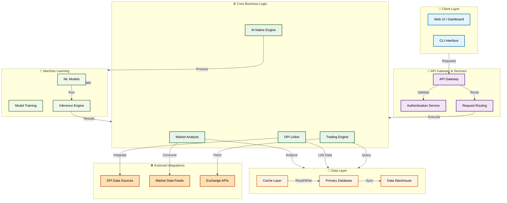

# Architecture Overview

This document provides a high-level architectural overview of the ExporoAI Trade Desk Operating System.

## System Architecture

## Component Descriptions

### Client Layer
- **Web UI / Dashboard**: User-facing interface for monitoring and managing trading operations
- **CLI Interface**: Command-line tools for automated workflows and scripting

### API Gateway & Services
- **API Gateway**: Central entry point for all client requests
- **Authentication Service**: Handles user authentication and authorization
- **Request Routing**: Routes requests to appropriate microservices

### Core Business Logic
- **Trading Engine**: Executes trading strategies and order management
- **DPI Linker**: Integrates with DPI (Data Provider Interface) systems for real-time data
- **AI Native Engine**: Core AI logic for autonomous decision-making and optimization
- **Market Analysis**: Processes and analyzes market data for insights

### Data Layer
- **Cache Layer**: High-speed caching for frequently accessed data
- **Primary Database**: Main transactional database for operational data
- **Data Warehouse**: Long-term storage and analytics database

### Machine Learning
- **ML Models**: Trained models for market prediction and strategy optimization
- **Model Training**: Continuous training pipeline for model improvement
- **Inference Engine**: Real-time inference for decision support

### External Integrations
- **DPI Data Sources**: Real-time data from DPI-linked providers
- **Market Data Feeds**: External market data and pricing information
- **Exchange APIs**: Connectivity to trading exchanges and venues

## Technology Stack

- **Language**: TypeScript (98.8%)
- **Architecture Pattern**: Microservices with API-first design
- **AI Integration**: AI-native components embedded throughout the system
- **Data Strategy**: Real-time processing with batch analytics capabilities

## Data Flow

1. **Ingestion**: Market data and DPI-linked information flows into the system via external integrations
2. **Processing**: Core business logic processes data through trading engine, AI engine, and market analysis
3. **Storage**: Data is cached for performance and stored in databases for persistence
4. **Analysis**: Machine learning models analyze patterns and provide insights
5. **Execution**: Trading decisions are executed through exchange APIs
6. **Monitoring**: Results and metrics flow back to the UI/Dashboard for user visibility
